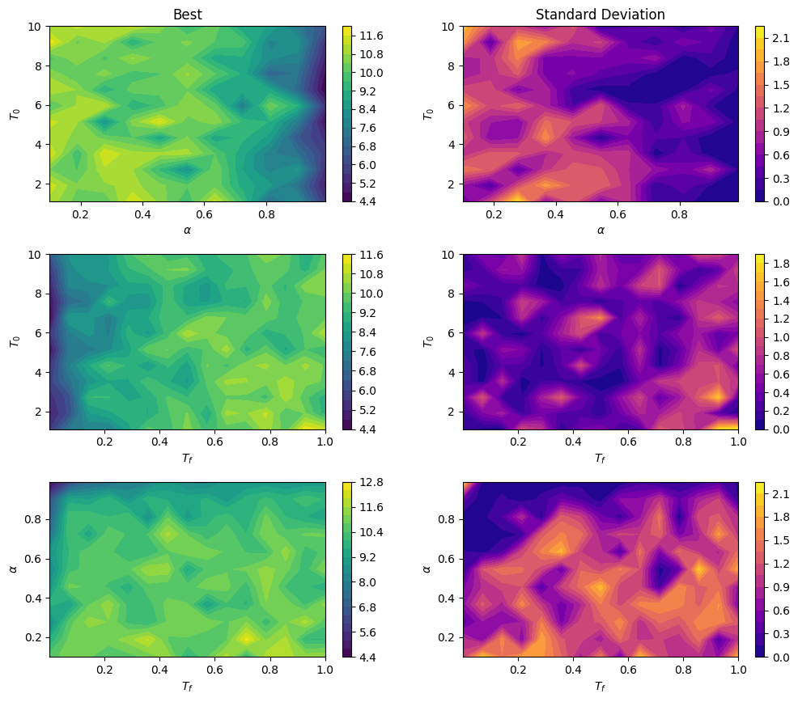
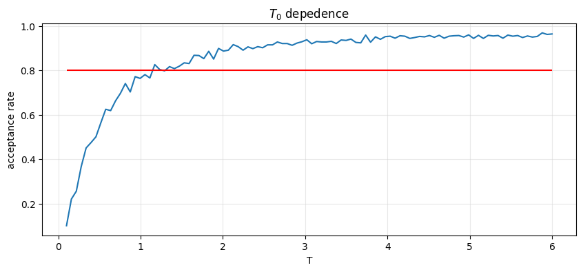

# Travelling salesman problem with simulated annealing
## Introduction
### Travelling salesman problem
The Travelling Salesman Problem (TSP) is a classic optimization problem in computer science and mathematics. The problem is defined as follows: Given a set of cities and the distances between each pair of cities, the objective is to find the shortest possible route that visits each city exactly once and returns to the starting city. \
The TSP is an NP-hard problem, which means that it is computationally difficult to find the exact optimal solution for large instances of the problem. As a result, various heuristics and approximation algorithms have been developed to find good solutions within reasonable time constraints. \
The TSP has numerous real-world applications in fields such as logistics, transportation, and network design. Solving the TSP can help optimize delivery routes, minimize travel time and costs, and improve the efficiency of supply chains.

### Simulated annealing
Simulated annealing is a stochastic optimization algorithm that is commonly used to solve combinatorial optimization problems such as the Travelling Salesman Problem (TSP). The algorithm is based on the physical process of annealing, where a metal is heated and cooled to obtain a desired structure. \
In simulated annealing, the algorithm starts with an initial solution and gradually explores the solution space by making small changes to the current solution. These changes are accepted or rejected based on a probability distribution that depends on the current temperature and the change in the objective function. The algorithm then cools down over time, reducing the probability of accepting worse solutions and converging towards a good solution. \
Simulated annealing is a popular optimization algorithm due to its ability to find good solutions for complex problems with many local optima. The algorithm is flexible and can be applied to a wide range of optimization problems, including TSP, scheduling, and resource allocation. However, the performance of the algorithm depends heavily on the choice of parameters such as the cooling schedule and the initial temperature, and tuning these parameters can be a challenging task. 

## My code
### Training
I generated a random distribution of cities and ran the simulated annealing algorithm to find the shortest possible route that visits each city exactly once and returns to the starting city. 

  
  

To evaluate the performance of the algorithm, I plotted a learning curve that shows the loss of the tested, accepted, and the best combination tested in simulated annealing.

  

### Hyperapameters
I wanted to test the impact of the three main hyperparameters: cooling factor, initial temperature, and end temperature. To do this, I systematically tested every combination of these three parameters and recorded the resulting loss for each combination. \
To visualize the results, I plotted the loss as a 2D contour plot, with one hyperparameter on each axis. By profiling each parameter separately, I was able to see how changes in each parameter affected the overall performance of the algorithm. For example, I could see how reducing the cooling factor affected the convergence rate of the algorithm, or how increasing the initial temperature affected the quality of the solutions found. \
In addition to recording the average loss for each combination of hyperparameters, I also calculated the standard deviation of the loss values. By looking at the standard deviation, I was able to see how much variation there was in the performance of the algorithm for each combination of hyperparameters. This allowed me to assess the robustness of the algorithm's results and identify any combinations of hyperparameters that produced consistently good or consistently poor results.

The role of hyperparameters could be further explored.
In particular, it is noted that:
* Distance is a hyperparameter: for specific problems it could be convenient to use the distance L1, or again, its definition could artificially create regions of space that one prefers not to cover. In the section _real world_ it will become more evident.
* The cooling function is a hyperparameter: we chose to use the update rule $T^{i+1} = \alpha T^i$ but we might prefer an exponential, logarithmic or quadratic dependence.

I also specifically focused on the initial temperature parameter. To do this, I developed a constant temperature version of the algorithm and tested different values of the initial temperature to see how they affected the initial acceptance rate. \
An optimal choice for the initial temperature parameter is one that guarantees an initial acceptance rate of around 80%. 

  
  

I created also a GIF that shows the different tested configurations and how the algorithm converges towards an optimal solution over time.

  
  

### Real scenario
To demonstrate the applicability of the simulated annealing algorithm for real-world scenarios, I downloaded the map of Padua (in Italy) using the osmnx package and obtained the positions of several cafes. Using this information, I implemented the simulated annealing algorithm using graph techniques.\
The algorithm takes the map of Padua and the positions of the cafes as inputs, and constructs a graph where each node represents a cafe and the edges between nodes represent the distance between them, considering the streets and buldings of Padua. The simulated annealing algorithm then uses this graph to find the shortest possible route that visits each cafe exactly once and returns to the starting cafe

  

